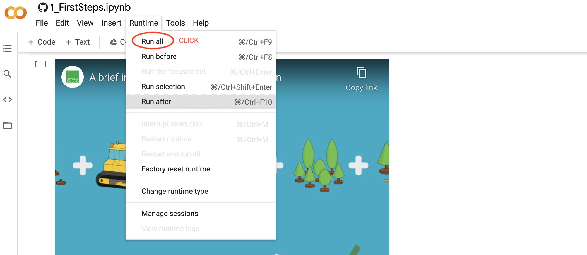

# Using satellite data to monitor urban green space
### Joe Fennell, 2021
In this activity, we will look at the use of satellite data to address the United Nations' Sustainable Development Goals (SDGs) through a mixture of learning material and experimentation with real data. This will take you about 1 hour to work through.

|  |
|:---:|
|*Sentinel-2 Satellite. Image from the European Space Agency*|

## How to access this resource 
This learning resource is a [Jupyter Notebook](https://jupyter.org/). It brings together text, images and code, allowing us to try out techniques alongside the relevant information. I have used the [Python](https://www.python.org/) programming language to produce this but you don't need to know Python to use this resource.

A Jupyter Notebook can either be used *statically* (you can only view the contents) or *dynamically* (you can run, alter, re-run and interact with the Python code within the notebook). You can do many useful things with Jupyter Notebooks and [there is a useful demonstration Notebook here](https://nbviewer.jupyter.org/github/jupyter/notebook/blob/master/docs/source/examples/Notebook/Notebook%20Basics.ipynb) that explains the different features.

If you are reading this information on the GitHub website or in another *static* format, you won't be able to use the interactive features. If you would like to interact with the experiments below, please click:  to open the Jupyter Notebook in Google Colaboratory. This sometimes requires you to log in to a google account but once you have created an account and logged in, it is free to use. Alternatively, you can view a static version 

Once you have opened this activity in Google Colaboratory ([click this link](https://colab.research.google.com/github/joe-fennell/eo-for-sdgs/blob/main/1_FirstSteps.ipynb)) it is important to run the entire notebook before continuing. Do this now by clicking `Runtime > Run all` in the menu above.

>Note: if you double click on this cell, you will view the markdown code instead of the rendered text. Simply re-run the cell or the whole notebook (see above) to return it to the original state.

